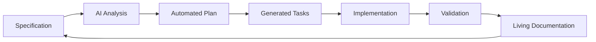

# SpecKit Documentation: Spec-Driven Development

[](https://github.com/SpecKit/documentation/actions)
[](https://github.com/SpecKit/documentation/actions)
[](https://www.w3.org/WAI/WCAG21/quickref/)
[](https://web.dev/measure/)

> **Transform specifications into implementation automatically**

Welcome to the **SpecKit** documentation repository. This project demonstrates **spec-driven development** methodology using **SpecKit** principles, built with Mintlify for beautiful, interactive documentation.

## 🎯 What is SpecKit?

**SpecKit** is a revolutionary approach to software development that eliminates the gap between documentation and implementation. Unlike traditional development that manually translates requirements into code, **SpecKit** methodology transforms executable specifications directly into working software.

### Key Differentiators

- **🔄 Automated Transformation**: Specifications become implementation automatically
- **📋 Executable Contracts**: Specs are validated continuously, not just documented
- **⚖️ Constitutional Governance**: Quality rules enforced automatically
- **🔗 Living Documentation**: Docs evolve with code without manual intervention
- **🚀 Zero Drift**: Perfect alignment between specification and implementation

## 🚀 Quick Start

### View the Documentation

Visit **[SpecKit.dev](https://SpecKit.dev)** to explore the complete documentation.

### Local Development

1. **Clone with submodules**:
   ```bash
   git clone --recursive https://github.com/SpecKit/documentation.git
   cd documentation
   ```

2. **Install dependencies**:
   ```bash
   npm install
   ```

3. **Start development server**:
   ```bash
   npm run dev
   ```

4. **Open browser**: Navigate to `http://localhost:3000`

### Try Spec Kit Methodology

Experience spec-driven development in minutes using the Specify CLI:

```bash
# Create a new project
uvx --from git+https://github.com/github/spec-kit.git specify init my-spec-project --ai claude

# Or initialize in the current directory
uvx --from git+https://github.com/github/spec-kit.git specify init --here --ai copilot

# Verify tooling
uvx --from git+https://github.com/github/spec-kit.git specify check

# Then use your AI coding agent to run:
# /specify  - create specifications
# /plan     - generate implementation plans
# /tasks    - create task breakdowns
```

## 📁 Project Architecture

This repository demonstrates **SpecKit** principles in practice:

```
SpecKit-documentation/
├── 📋 specs/                          # Executable specifications
│   └── 001-SpecKit-documentation-website/
│       ├── spec.md                    # Feature specification
│       ├── plan.md                    # Implementation plan  
│       ├── tasks.md                   # Task breakdown
│       ├── research.md                # Technology research
│       ├── data-model.md              # Content structure
│       ├── quickstart.md              # Validation scenarios
│       └── contracts/                 # JSON Schema contracts
│           ├── content-api.json       # Content validation
│           ├── navigation.json        # Navigation structure
│           ├── i18n.json             # Multi-language support
│           └── extensions.json        # Extension definitions
├── 📚 Documentation Content/
│   ├── introduction.mdx               # Strategic positioning
│   ├── quickstart.mdx                 # 5-minute tutorial
│   ├── methodology/                   # SDD philosophy & principles
│   ├── getting-started/               # Installation & first project
│   ├── core-concepts/                 # Specifications & planning
│   ├── workflows/                     # Command usage & patterns
│   ├── extensions/                    # CI/CD, visualization, examples
│   ├── development/                   # Environment & contributing
│   ├── examples/                      # Real-world demonstrations
│   ├── templates/                     # Reusable patterns
│   └── reference/                     # Complete API documentation
├── 🌍 Multi-Language Support/
│   └── i18n/
│       ├── zh/                        # Chinese (中文)
│       └── ja/                        # Japanese (日本語)
├── 🔧 Automation & Validation/
│   ├── scripts/
│   │   ├── validate-content.js        # Contract validation
│   │   ├── validate-seo.js           # SEO optimization
│   │   └── sync-submodule.sh         # Automated sync
│   └── .github/workflows/
│       └── deploy.yml                 # CI/CD pipeline
├── 📊 SEO & Analytics/
│   └── seo/
│       └── meta-templates.json        # SEO optimization
├── 🔗 External Integration/
│   └── external/
│       └── spec-kit/                 # GitHub Spec Kit submodule
└── ⚙️ Configuration/
    ├── mint.json                      # Mintlify configuration
    ├── package.json                   # Dependencies & scripts
    └── README.md                      # This file
```

## 🛠️ Development Workflow

### Available Scripts

```bash
# Development
npm run dev                    # Start Mintlify dev server
npm run build                  # Build for production

# Validation
npm run validate              # Run all validations
npm run validate:content      # Validate against contracts
npm run validate:seo          # Check SEO optimization

# Maintenance  
npm run sync:submodule        # Update SpecKit submodule
npm run lint                  # Code quality checks
npm run format                # Auto-format code
```

### Content Creation Process

This project follows **SpecKit** methodology:

1. **📋 Specification First**: All features start with executable specifications
2. **📝 Plan Generation**: Implementation plans generated from specs
3. **✅ Task Breakdown**: Detailed tasks created automatically
4. **🔍 Validation**: Content validated against JSON Schema contracts
5. **🚀 Automated Deployment**: CI/CD pipeline handles validation and deployment

### Quality Gates

Every change must pass:

- ✅ **Content Validation**: JSON Schema contract compliance
- ✅ **SEO Optimization**: Keyword targeting and meta optimization
- ✅ **Accessibility**: WCAG 2.1 AA compliance
- ✅ **Performance**: Lighthouse scores 90+
- ✅ **Link Integrity**: All internal/external links functional

## 🌍 Multi-Language Support

Documentation available in:

- **🇺🇸 English** (Primary)
- **🇨🇳 Chinese (中文)** - Simplified Chinese with cultural adaptation
- **🇯🇵 Japanese (日本語)** - Full localization with cultural context

### SEO Keyword Strategy

Optimized for multiple keyword variations:
- **Primary**: `SpecKit`, `SpecKit`, `spec driven development`
- **Chinese**: `规范工具包`, `规范驱动开发`
- **Japanese**: `仕様キット`, `仕様駆動開発`

## 🔄 Automated Synchronization

### Spec Kit Submodule Integration

The repository includes the official [github/spec-kit](https://github.com/github/spec-kit) as a submodule:

- **📅 Daily Sync**: Automated updates via GitHub Actions
- **🔄 Change Detection**: Automatic PR creation for updates
- **✅ Validation**: Content sync validated against contracts
- **📚 Living Reference**: Documentation stays current with SpecKit evolution

### CI/CD Pipeline

Comprehensive automation:

```yaml
Triggers: Push, PR, Daily Schedule
├── Content Validation
├── SEO Optimization Check  
├── Accessibility Testing
├── Performance Benchmarking
├── Submodule Synchronization
└── Mintlify Cloud Deployment
```

## 🎯 Strategic Positioning

### Beyond Amazon's Kiro

While Amazon's Kiro introduced spec-mode development, **Speckit** has a more ambitious vision:

- **Kiro**: Spec-mode within existing workflows
- **Speckit**: Complete transformation from specification to implementation
- **Goal**: Zero human intervention in the documentation→implementation pipeline

### The Transformation Vision



## 🤝 Contributing

We welcome contributions to improve **SpecKit** documentation:

### Getting Started

1. **Fork** the repository
2. **Create** a feature branch: `git checkout -b feature/amazing-improvement`
3. **Follow** SpecKit methodology:
   - Write specification first (`specs/`)
   - Generate implementation plan
   - Create detailed tasks
4. **Validate** your changes: `npm run validate`
5. **Submit** a pull request

### Contribution Guidelines

- ✅ **Specification-First**: All features must start with executable specs
- ✅ **Contract Compliance**: Content must validate against JSON schemas
- ✅ **SEO Optimization**: Include both `SpecKit` and `SpecKit` keywords
- ✅ **Accessibility**: Maintain WCAG 2.1 AA compliance
- ✅ **Multi-Language**: Consider translation impact for major changes

## 📊 Performance & Quality

### Metrics

- **🚀 Performance**: Page load < 2 seconds
- **♿ Accessibility**: WCAG 2.1 AA compliance (95%+)
- **🔍 SEO**: Core Web Vitals all green (90%+)
- **⏱️ Uptime**: 99.9% availability target
- **📱 Mobile**: Responsive design, mobile-first

### Monitoring

- **📈 Analytics**: Google Analytics 4 integration
- **🔍 Search Console**: SEO performance tracking
- **⚡ Lighthouse**: Automated performance auditing
- **🛡️ Security**: Automated vulnerability scanning

## 🔗 Links & Resources

### Documentation

- **📚 Docs Source**: this repo
- **🔧 Spec Kit Source**: [github.com/github/spec-kit](https://github.com/github/spec-kit)

### Community

- **🐛 Issues (Spec Kit)**: [github/spec-kit/issues](https://github.com/github/spec-kit/issues)
- **🐦 Twitter**: [@SpecKit](https://twitter.com/SpecKit)

### Technology Stack

- **📝 Content**: Mintlify + MDX
- **🎨 Styling**: Tailwind CSS
- **🔍 Search**: Algolia DocSearch
- **📊 Analytics**: Google Analytics 4
- **🚀 Hosting**: Mintlify Cloud
- **⚙️ CI/CD**: GitHub Actions

## 📄 License

This project is licensed under the **MIT License** - see the [LICENSE](LICENSE) file for details.

---

<div align="center">

**Built with ❤️ using [Spec-Kit Methodology](https://SpecKit.dev/methodology/philosophy)**

*Transforming specifications into implementation, automatically.*

</div>
