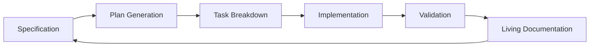

# The Philosophy of Spec-Driven Development

**Spec-driven development (SDD)** represents a fundamental shift in how we approach software creation. At its core, **Speckit** embodies a revolutionary philosophy: **specifications should not just describe what we want to build—they should become the foundation from which we build it**.

## The Traditional Problem

For decades, software development has suffered from a persistent gap between **what we document** and **what we actually implement**:

<CardGroup cols={2}>
  <Card title="Documentation Drift" icon="file-text">
    Specifications become outdated the moment implementation begins
  </Card>
  <Card title="Implementation Variance" icon="code">
    What gets built rarely matches what was originally specified
  </Card>
  <Card title="Manual Synchronization" icon="refresh">
    Keeping docs and code aligned requires constant manual effort
  </Card>
  <Card title="Quality Degradation" icon="triangle-exclamation">
    Inconsistencies lead to bugs, confusion, and technical debt
  </Card>
</CardGroup>

## The Spec-Kit Vision

**Speckit's** philosophy addresses this fundamental challenge through a transformative approach:

<Note>
**Core Principle**: Specifications become executable, living documents that automatically generate and validate implementation.
</Note>

### Beyond Documentation

Traditional documentation is **static**—it describes intent but cannot enforce it. **Spec-kit** transforms specifications into **dynamic, executable contracts** that:

- **Generate implementation** automatically from specifications
- **Validate compliance** continuously against defined requirements  
- **Evolve synchronously** with changing business needs
- **Eliminate drift** between documentation and reality

### The Transformation Process

The **speckit** methodology follows a clear transformation pipeline:



## Core Philosophical Principles

### 1. Specifications as Source of Truth

In **spec-driven development**, specifications are not suggestions—they are **constitutional law** for your project:

- **Single Source of Truth**: All implementation decisions trace back to specifications
- **Constitutional Governance**: Built-in rules ensure consistency and quality
- **Automated Enforcement**: Violations are detected and prevented automatically

### 2. Transformation Over Translation

Traditional development **translates** requirements into code. **Spec-kit** **transforms** specifications into implementation:

<Tabs>
  <Tab title="Traditional Translation">
    ```
    Requirements → Analysis → Design → Code → Testing → Documentation
    ```
    *Each step introduces potential for drift and inconsistency*
  </Tab>
  <Tab title="Spec-Kit Transformation">
    ```
    Specification → Automated Plan → Generated Tasks → Validated Implementation
    ```
    *Direct transformation maintains perfect alignment*
  </Tab>
</Tabs>

### 3. Living Documentation

**Speckit** documentation is **alive**—it evolves, validates, and enforces itself:

- **Self-Updating**: Documentation reflects current implementation state
- **Self-Validating**: Automatically detects and reports inconsistencies
- **Self-Enforcing**: Prevents changes that violate specifications

## The Bigger Vision: Eliminating Human Intervention

### Beyond Amazon's Kiro

While Amazon's Kiro introduced spec-mode development, **Speckit** has a more ambitious vision. **Spec-kit** aims to eliminate the gap between documentation and implementation entirely:

<Accordion title="Speckit vs. Kiro: The Fundamental Difference">
  **Kiro** focuses on spec-mode development within existing workflows.
  
  **Speckit** reimagines the entire development process around executable specifications, aiming for **zero human intervention** in the transformation from specification to implementation.
</Accordion>

### The Automation Goal

The ultimate **speckit** vision is **fully automated transformation**:

1. **Specifications** define what should be built
2. **AI agents** generate implementation plans automatically  
3. **Automated systems** execute tasks and validate results
4. **Living documentation** maintains itself without human intervention

## Practical Benefits

### For Developers

- **Reduced cognitive load**: Focus on problem-solving, not documentation maintenance
- **Faster iteration**: Changes propagate automatically through the system
- **Higher confidence**: Automated validation catches issues early

### For Teams

- **Perfect alignment**: Everyone works from the same source of truth
- **Reduced meetings**: Specifications eliminate ambiguity and miscommunication
- **Faster onboarding**: New team members understand the system through executable specs

### For Organizations

- **Predictable delivery**: Automated planning provides accurate estimates
- **Quality assurance**: Constitutional governance prevents technical debt
- **Scalable processes**: Methodology scales from individual projects to enterprise systems

## Implementation Philosophy

### Start Small, Think Big

**Spec-kit** philosophy embraces incremental adoption:

<Steps>
  <Step title="Begin with Specifications">
    Start by writing clear, executable specifications for new features
  </Step>
  <Step title="Add Automation Gradually">
    Introduce automated planning and task generation incrementally
  </Step>
  <Step title="Expand Constitutional Governance">
    Build quality rules and validation into your development process
  </Step>
  <Step title="Achieve Full Transformation">
    Reach the goal of automated specification-to-implementation transformation
  </Step>
</Steps>

### Constitutional Development

Every **speckit** project operates under a **constitution**—a set of fundamental rules that govern:

- **Quality standards** that cannot be compromised
- **Architectural principles** that guide all decisions
- **Process requirements** that ensure consistency
- **Validation criteria** that define success

## The Future of Development

**Spec-driven development** represents the future of software creation:

- **AI-assisted specification** writing and validation
- **Automated implementation** generation from specifications
- **Continuous validation** against business requirements
- **Self-healing systems** that maintain specification compliance

<Warning>
**Important**: The goal is not to replace developers, but to **amplify their capabilities** by eliminating repetitive, error-prone tasks and allowing focus on creative problem-solving and innovation.
</Warning>

## Getting Started with the Philosophy

Ready to embrace **spec-driven development**? Start by shifting your mindset:

1. **Think specification-first**: Before writing code, write executable specifications
2. **Embrace automation**: Look for opportunities to automate transformation processes  
3. **Build constitutionally**: Establish and enforce quality rules from the beginning
4. **Measure alignment**: Track how well implementation matches specifications

The **speckit** philosophy is not just about tools—it's about fundamentally reimagining how we create software. By treating specifications as executable contracts rather than static documentation, we can build systems that are more reliable, maintainable, and aligned with business needs.

---

**Next**: Learn about the [core principles](/methodology/principles) that guide spec-driven development implementation.
