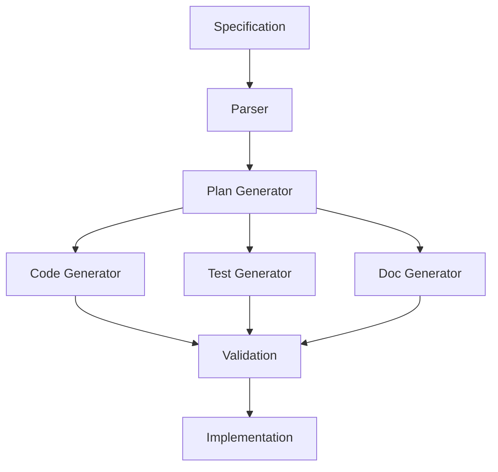

# Core Principles of Spec-Kit Methodology

The **speckit** methodology is built on five fundamental principles that guide every aspect of **spec-driven development**. These principles ensure that **spec-kit** implementations remain consistent, reliable, and effective across all projects and teams.

## The Five Pillars of Spec-Kit

<CardGroup cols={2}>
  <Card title="Executable Specifications" icon="play">
    Specifications must be executable and verifiable, not just descriptive
  </Card>
  <Card title="Constitutional Governance" icon="scale-balanced">
    Quality rules are enforced automatically, not left to chance
  </Card>
  <Card title="Transformation Automation" icon="robot">
    Manual translation is replaced with automated transformation
  </Card>
  <Card title="Living Documentation" icon="heart-pulse">
    Documentation evolves with implementation automatically
  </Card>
  <Card title="Continuous Validation" icon="shield-check">
    Compliance is verified continuously, not just at milestones
  </Card>
</CardGroup>

---

## Principle 1: Executable Specifications

### The Principle

**Specifications must be executable and verifiable, not just descriptive.**

Traditional specifications describe what should be built. **Spec-kit** specifications define what **will** be built and provide mechanisms to verify that it was built correctly.

### Key Characteristics

<Tabs>
  <Tab title="Executable">
    ```yaml
    # Traditional Specification (Descriptive)
    "The system should validate user input"
    
    # Spec-Kit Specification (Executable)
    validation:
      rules:
        - field: email
          type: email
          required: true
        - field: password
          minLength: 8
          pattern: "^(?=.*[A-Za-z])(?=.*\\d)[A-Za-z\\d]{8,}$"
      onFailure: 
        action: reject
        message: "Validation failed: {errors}"
    ```
  </Tab>
  <Tab title="Verifiable">
    ```javascript
    // Generated Test from Specification
    describe('User Input Validation', () => {
      it('should validate email format', () => {
        expect(validate({email: 'invalid'})).toBe(false);
        expect(validate({email: 'user@example.com'})).toBe(true);
      });
      
      it('should enforce password requirements', () => {
        expect(validate({password: '123'})).toBe(false);
        expect(validate({password: 'password123'})).toBe(true);
      });
    });
    ```
  </Tab>
</Tabs>

### Implementation Guidelines

1. **Use Structured Formats**: YAML, JSON, or domain-specific languages
2. **Include Validation Rules**: Define success and failure criteria
3. **Specify Expected Outcomes**: What should happen in each scenario
4. **Provide Test Cases**: Include examples and edge cases

<Note>
**Best Practice**: Every specification should be testable by automated systems without human interpretation.
</Note>

---

## Principle 2: Constitutional Governance

### The Principle

**Quality rules are enforced automatically, not left to chance.**

Every **speckit** project operates under a constitution—a set of inviolable rules that govern all development decisions. These rules are enforced automatically, preventing quality degradation.

### Constitutional Elements

<AccordionGroup>
  <Accordion title="Quality Gates">
    Automated checks that prevent low-quality code from entering the system:
    - Code coverage thresholds
    - Performance benchmarks  
    - Security vulnerability scans
    - Accessibility compliance
  </Accordion>
  
  <Accordion title="Architectural Constraints">
    Rules that maintain system integrity:
    - Dependency restrictions
    - Layer separation enforcement
    - API contract validation
    - Data flow constraints
  </Accordion>
  
  <Accordion title="Process Requirements">
    Mandatory steps in the development workflow:
    - Specification-first development
    - Automated testing requirements
    - Code review processes
    - Documentation updates
  </Accordion>
</AccordionGroup>

### Example Constitution

```yaml
# Project Constitution
constitution:
  quality_gates:
    code_coverage: 
      minimum: 80%
      enforcement: block_merge
    performance:
      response_time: <200ms
      enforcement: fail_build
    security:
      vulnerabilities: zero_critical
      enforcement: block_deployment
      
  architectural_rules:
    - "No direct database access from UI components"
    - "All external APIs must use circuit breakers"
    - "Authentication required for all endpoints except health checks"
    
  process_requirements:
    - specification_before_implementation: true
    - automated_tests_required: true
    - documentation_sync_required: true
```

---

## Principle 3: Transformation Automation

### The Principle

**Manual translation is replaced with automated transformation.**

Instead of humans interpreting specifications and manually creating implementation, **spec-kit** uses automated systems to transform specifications directly into working code, tests, and documentation.

### Transformation Pipeline



### Automation Levels

<Steps>
  <Step title="Level 1: Plan Generation">
    Specifications automatically generate implementation plans and task breakdowns
  </Step>
  <Step title="Level 2: Code Scaffolding">
    Basic code structure and boilerplate generated from specifications
  </Step>
  <Step title="Level 3: Logic Implementation">
    Business logic and algorithms generated from detailed specifications
  </Step>
  <Step title="Level 4: Full Automation">
    Complete implementation generated with minimal human intervention
  </Step>
</Steps>

### Benefits of Automation

- **Consistency**: Automated generation eliminates human interpretation errors
- **Speed**: Transformation happens in seconds, not hours or days
- **Accuracy**: Generated code perfectly matches specifications
- **Maintainability**: Changes to specifications automatically update implementation

---

## Principle 4: Living Documentation

### The Principle

**Documentation evolves with implementation automatically.**

Traditional documentation becomes stale the moment it's written. **Spec-kit** documentation is **alive**—it updates itself, validates its accuracy, and maintains perfect synchronization with implementation.

### Living Documentation Characteristics

<CardGroup cols={3}>
  <Card title="Self-Updating" icon="arrows-rotate">
    Documentation reflects current state automatically
  </Card>
  <Card title="Self-Validating" icon="magnifying-glass">
    Detects and reports inconsistencies
  </Card>
  <Card title="Self-Healing" icon="heart-pulse">
    Corrects minor discrepancies automatically
  </Card>
</CardGroup>

### Implementation Strategies

1. **Generated Documentation**: Create docs directly from code and specifications
2. **Embedded Validation**: Include checks that verify documentation accuracy
3. **Automated Updates**: Trigger documentation updates on code changes
4. **Continuous Monitoring**: Track documentation health and freshness

### Example: Living API Documentation

```yaml
# Specification
api:
  endpoint: /users/{id}
  method: GET
  parameters:
    - name: id
      type: integer
      required: true
  responses:
    200:
      schema: User
      example: { "id": 1, "name": "John Doe" }
    404:
      message: "User not found"

# Generated Documentation (automatically updated)
# Generated Tests (automatically validated)  
# Generated Implementation (automatically synchronized)
```

---

## Principle 5: Continuous Validation

### The Principle

**Compliance is verified continuously, not just at milestones.**

**Spec-kit** systems continuously validate that implementation matches specifications. This prevents drift and catches issues immediately rather than discovering them weeks or months later.

### Validation Dimensions

<Tabs>
  <Tab title="Functional Validation">
    - Does the implementation behave as specified?
    - Are all requirements satisfied?
    - Do edge cases work correctly?
  </Tab>
  <Tab title="Quality Validation">
    - Does code meet quality standards?
    - Are performance requirements met?
    - Is security properly implemented?
  </Tab>
  <Tab title="Process Validation">
    - Are constitutional rules followed?
    - Is documentation synchronized?
    - Are tests comprehensive?
  </Tab>
</Tabs>

### Continuous Validation Pipeline


### Validation Tools

- **Specification Compliance Checkers**: Verify implementation matches specs
- **Quality Monitors**: Track code quality metrics continuously
- **Performance Profilers**: Ensure performance requirements are met
- **Security Scanners**: Detect vulnerabilities in real-time

---

## Applying the Principles

### Getting Started

1. **Choose Your First Principle**: Start with executable specifications
2. **Build Incrementally**: Add constitutional governance gradually
3. **Automate Progressively**: Introduce transformation automation step by step
4. **Monitor Continuously**: Implement validation from day one

### Common Pitfalls

<Warning>
**Avoid These Mistakes**:
- Treating specifications as documentation instead of executable contracts
- Implementing governance rules without automation
- Trying to automate everything at once
- Validating only at the end of development cycles
</Warning>

### Success Metrics

Track these metrics to measure principle adoption:

- **Specification Coverage**: Percentage of features with executable specs
- **Automation Level**: Degree of automated transformation
- **Validation Frequency**: How often compliance is checked
- **Documentation Freshness**: How current documentation remains

---

## The Principles in Practice

### Example: User Authentication Feature

Here's how all five principles work together in a real **spec-kit** implementation:

<Accordion title="1. Executable Specification">
```yaml
feature: user_authentication
requirements:
  - secure_login: true
  - session_management: true
  - password_requirements:
      min_length: 8
      require_special_chars: true
validation:
  - test_valid_login
  - test_invalid_credentials
  - test_session_expiry
```
</Accordion>

<Accordion title="2. Constitutional Rules">
```yaml
constitution:
  security:
    - "All passwords must be hashed with bcrypt"
    - "Sessions must expire after 24 hours"
    - "Failed login attempts must be rate limited"
```
</Accordion>

<Accordion title="3. Automated Transformation">
```javascript
// Generated from specification
class AuthenticationService {
  async login(email, password) {
    // Implementation generated from spec
  }
  
  validatePassword(password) {
    // Validation rules from spec
  }
}
```
</Accordion>

<Accordion title="4. Living Documentation">
```markdown
# Authentication API
<!-- Auto-generated from specification -->
## POST /auth/login
Authenticates user with email and password.
<!-- Documentation updates automatically with spec changes -->
```
</Accordion>

<Accordion title="5. Continuous Validation">
```yaml
validation_pipeline:
  - spec_compliance_check
  - security_scan
  - performance_test
  - integration_test
```
</Accordion>

These five principles work together to create a development process that is **reliable**, **efficient**, and **maintainable**. By following these principles, **spec-kit** projects achieve the goal of eliminating the gap between specification and implementation.

---

**Next**: Explore the [transformation process](/methodology/transformation) that turns specifications into working software.
